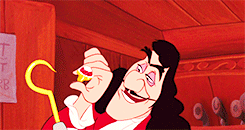

<h1 align="center">Captain hook</h1>
<p align="center"></p>

## Overview

Here a modest list of hooks that I use every day. I will add more next few days, keep watching. And if you have some good hooks I would love to add them. So feel free to open a pull request.

## Hooks

### `useFetch` - [View code](https://github.com/stevenpersia/captain-hook/blob/master/useFetch.js)

Useful hook if you want to fetch data from a url.

#### How to use

Import hook :

```js
import useFetch from "hooks/useFetch";
```

Then use like this :

```js
const { response, errors } = useFetch("https://github.com/stevenpersia/");
```

#### Demo

SOON...

---

### `useFullscreen` - [View code](https://github.com/stevenpersia/captain-hook/blob/master/useFullscreen.js)

Useful hook if you want to fullscreen an element of your page.

#### How to use

Import hook :

```js
import useFullscreen from "hooks/useFullscreen";
```

Add :

```js
const { elementFS, triggerFS, exitFS, isFS } = useFullscreen();
```

Then use like this :

```html
<div ref="{elementFS}">I want to fullscreen this div.</div>
<button onClick="{triggerFS}">Trigger fullscreen</button>
<button onClick="{exitFS}">Exit fullscreen</button>
```

Check if fullscreen is triggered :

```js
console.log(isFS);
```

#### Demo

SOON...

---

### `useHover` - [View code](https://github.com/stevenpersia/captain-hook/blob/master/useHover.js)

Useful hook if you want to detect when the mouse is hovering an element.

#### How to use

Import hook :

```js
import useHover from "hooks/useHover";
```

Add :

```js
const [hoverRef, isHovered] = useHover();
```

Then use like this :

```html
<div ref="{hoverRef}">{isHovered ? "Hovered !" : "Hover me !"}</div>
```

#### Demo

SOON...

---

### `useKeyPress` - [View code](https://github.com/stevenpersia/captain-hook/blob/master/useKeyPress.js)

Useful hook if you want to detect when user is pressing a specific key.

#### How to use

Import hook :

```js
import useKeyPress from "hooks/useKeyPress";
```

Then use like this :

```js
const hKeyPressed = useKeyPress("h");

console.log(hKeyPressed & "Hello !");
// → Hello !
```

#### Demo

SOON...

---

### `useSlug` - [View code](https://github.com/stevenpersia/captain-hook/blob/master/useSlug.js)

Useful hook if you want to slug content for urls.

#### How to use

Import hook :

```js
import useSlug from "hooks/useSlug";
```

Then use like this :

```js
useSlug("Omégà! Pèlô Fùll");
// → omega-pelo-full
```

#### Demo

SOON...

---

### `useSwap` - [View code](https://github.com/stevenpersia/captain-hook/blob/master/useSwap.js)

Useful hook if you want to swap the keys and values of a given object.

#### How to use

Import hook :

```js
import useSwap from "hooks/useSwap";
```

Then use like this :

```js
useSwap({ name: "A", init: "bootstrap" });
// → {A: "name", bootstrap: "init"}
```

#### Demo

SOON...

---

### `useTitle` - [View code](https://github.com/stevenpersia/captain-hook/blob/master/useTitle.js)

Useful hook if you want to set a specific title to page.

#### How to use

Import hook :

```js
import useTitle from "hooks/useTitle";
```

Then use like this :

```js
useTitle("My title");
```

#### Demo

SOON...

---

### `useToggle` - [View code](https://github.com/stevenpersia/captain-hook/blob/master/useToggle.js)

Useful hook if you want display/hide something with toggle.

#### How to use

Import hook :

```js
import useToggle from "hooks/useToggle";
```

Then use like this :

```
const [open, toggle] = useToggle(false);

<Button onClick={toggle}>Show filters</Button>;
{open && <Filters />}
```

#### Demo

SOON...

## Star, Fork, Clone & Contribute

Feel free to contribute on this repository. If my work helps you, please give me back with a star. This means a lot to me and keeps me going!
